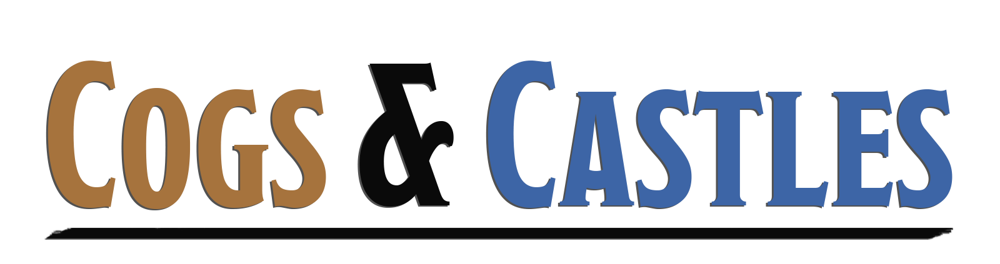

### Modpack Update Distro
Repository of Minecraft Modpack updates for the Cogs Updater.

### How It Works
- The Latest Update & Manifest pushed to the Release will be automatically downloaded by the Cogs Updater, installing it into your Game Directory.
- The ModManifest is a list of all mod files that should be installed, or retained by the installer. Anything file or outdated mods not listed in the manifest will be deleted automatically.
  - ModManifests can be generated from within the Dev Tools of the Cogs Updater.
